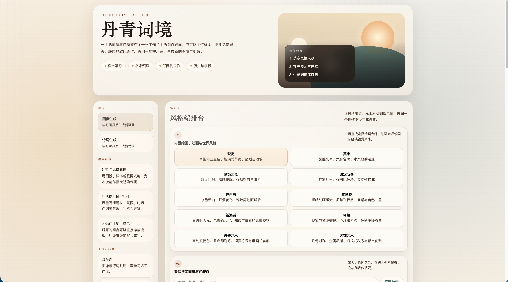
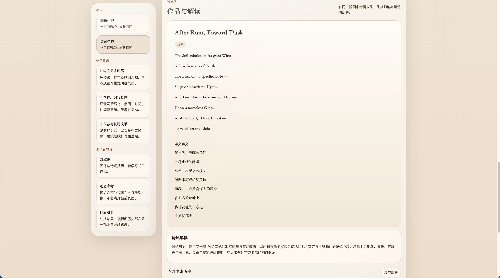
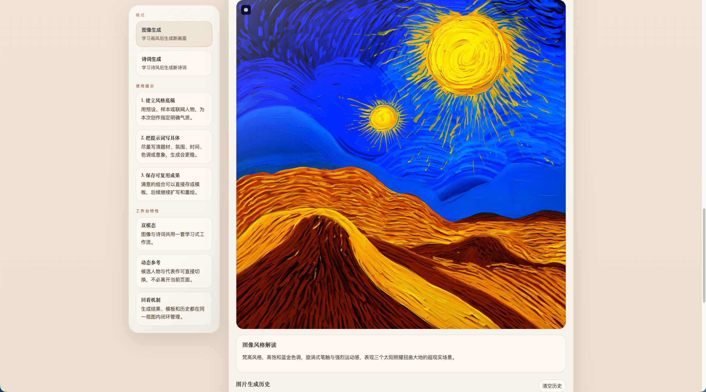

# 当AI开始一手画画一手写词，我怀疑创作圈要开始内卷了

有些项目，一看名字就知道它想干大事。比如“丹青词境”，这四个字摆在那里，气势已经不是普通工具应用了，而是那种仿佛打开页面就会飘出一句“阁下请先焚香再创作”的气质。

但别被名字骗了，这个项目干的事其实非常直白，而且很上头：它把“学画风生成图片”和“学诗风生成诗词”这两件事，塞进了同一个工作台里。你可以前脚让它参考梵高、宫崎骏和几张自己上传的图，后脚再让它模仿李白、柳永或者 Emily Dickinson 写一首新作。简单说，它像一个白天画画、晚上写词的 AI 同学。

这个项目最聪明的地方，不是“能生成”，而是它没有把生成这件事做得像抽卡。很多 AI 工具的问题是，你输入一句话，点一下按钮，然后对着结果进入玄学状态。丹青词境换了个思路，它会先把风格来源拆开给你看：预设是一层，上传样本是一层，联网检索来的艺术家与代表作又是一层。结果不是凭空冒出来的，而是沿着一条能解释清楚的链路长出来的。

到了图像模式，这种“先理解，再生成”的感觉尤其明显。你可以选绘画大师、动画导演、国际视觉风格，也可以上传参考图片。系统不是直接把提示词甩给图片模型，而是先让文本模型把这些信息揉成一份结构化的视觉风格摘要，再把摘要交给图像模型去画。通俗一点，就是先让 AI 做一遍“审题”，再正式动笔。

它也不是只会认老牌画家。绘画大师、动画大师和世界视觉风格都放进了预设里，所以用户不必先考过美术史，才能把“我想要一点宫崎骏，但别太像PPT封面”这种需求说清楚。

更有意思的是联网检索。你输入一个名字，系统会去找人物条目、摘要和代表作，还能自动判断这人到底该归到图像还是诗词模式。有人会在图像栏里搜柳永，也有人会在诗词栏里搜梵高。以前这种操作通常只会换来报错，现在它会自己识别、自己切换、自己把人送到该去的地方。

到了诗词模式，项目就开始展现它的“较真”。它不满足于只判断你搜到的是不是“诗歌类人物”，还会继续往下细分：是诗人、词人，还是俳人。别小看这个动作，这意味着生成不是统一走“来一首诗吧”这种大锅饭逻辑。搜到李白，它更偏向诗体；搜到柳永，它会按词体来，强调长短句、词牌名或词题；搜到松尾芭蕉，还会把结果往短诗、俳句的方向收。这个体验很妙，因为它终于不再把中文诗词创作当成一个模糊标签，而是开始尊重文体本身的规矩。

如果你以前用过一些“万能写诗 AI”，应该会懂这种差别有多大。很多工具写诗的思路，基本等于“把句子打断，多加几个明月春风秋雨”，最后读起来像朋友圈伤感文案突然决定参加文学比赛。丹青词境至少往前走了一步：它会把预设、样本、人物摘要、代表作信息一起送进生成链路，要求模型先总结风格，再输出新作，还能处理海外诗人风格并附上中文逐行翻译。

从产品角度看，这个项目还有一个特别讨喜的地方：它没有把自己做成“炫技型样机”，而是很认真地补了真实使用需要的那些边角。比如模板保存、生成历史、图片 PNG 导出、本地脚本一键启动和停止、服务端缓存、国内可访问的模型供应商默认配置。这些东西单看都不性感，但缺了它们，项目就会从“能用”滑回“能演示”。

所以如果你问我，这个项目最像什么？我会说，它像一个终于不再只会喊“我什么都能生成”的 AI 创作台，而是开始学会先听你说话、先理解风格，再拿出作品。它不保证每次都一击即中，但至少把“为什么会生成成这样”讲明白了。

说到底，真正让人愿意反复打开一个 AI 应用的，从来不是“它会不会”，而是“它懂不懂”。丹青词境现在给出的答案是：我不但想画，我还想先理解你为什么想这么画；我不但能写，我还想分清你到底要的是诗、词，还是一句能安静落在纸上的俳句。你别说，这种 AI，已经有点像人了。只不过比人稳定一点，也更愿意半夜两点陪你改稿。